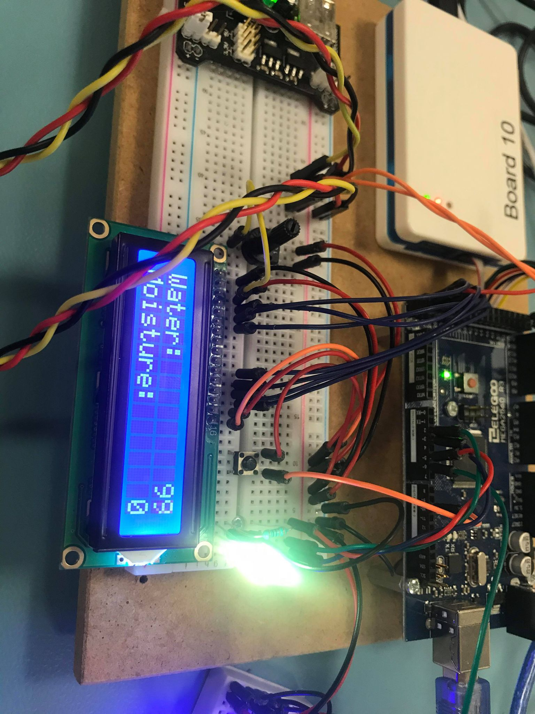

# Plant Watering System

> This is a school project.

## Table of contents
- [Plant Watering System](#plant-watering-system)
  - [Table of contents](#table-of-contents)
  - [About the project](#about-the-project)
    - [Built with](#built-with)
  - [Diagrams](#diagrams)
  - [Dependencies](#dependencies)
  - [License](#license)
  - [Contact](#contact)
  - [Acknowledgements](#acknowledgements)
  - [Resources](#resources)

## About the project

This approach would be able to service a single plant.

A single SoC should have an LCD that displays metrics about the plant (soil moisture, tank water level). The plant pot should have a soil moisture sensor to help determine when to water the plant. A RGB LED to help show how much water is left in the tank.

### Built with

Works when compiled using [GCC (GNU Compiler Collection)](https://gcc.gnu.org/).

_Components needed for this approach:_

- LCD
- Button
- Soil moisture sensor
- Water level sensor
- Relay (to simulate a water pump)
- RGB LED

<table>
  <thead>
  <tr>
    <th>Sensor</th>
    <th>Use Case</th>
    <th align="center">Port Pin</th>
    <th align="center">Physical Pin</th>
  </tr>
  </thead>
  <tbody>

  <tr>
    <td>Moisture Sensor</td>
    <td>used to determine how moist the plant is</td>
    <td align="center">PK2</td>
    <td align="center">87</td>
  </tr>
  <tr>
    <td>Water Level Sensor</td>
    <td>used to determine how much water is left in the tank</td>
    <td align="center">PK3</td>
    <td align="center">86</td>
  </tr>
  <tr>
    <td>Button</td>
    <td>used to change the menu</td>
    <td align="center">PB4</td>
    <td align="center">23</td>
  </tr>

  <tr>
    <td rowspan=8>LCD</td>
    <td>used to display the metrics/data about the water level and moisture level</td>
    <td></td>
    <td></td>
  </tr>

  <tr>
    <td>LCD_DATA0_PIN</td>
    <td align="center">PA3</td>
    <td align="center">75</td>
  </tr>

  <tr>
    <td>LCD_DATA1_PIN</td>
    <td align="center">PA4</td>
    <td align="center">74</td>
  </tr>

  <tr>
    <td>LCD_DATA2_PIN</td>
    <td align="center">PA5</td>
    <td align="center">73</td>
  </tr>

  <tr>
    <td>LCD_DATA3_PIN</td>
    <td align="center">PA6</td>
    <td align="center">72</td>
  </tr>

  <tr>
    <td>LCD_RS_PIN</td>
    <td align="center">PA0</td>
    <td align="center">78</td>
  </tr>

  <tr>
    <td>LCD_RW_PIN</td>
    <td align="center">PA1</td>
    <td align="center">77</td>
  </tr>

  <tr>
    <td>LCD_E_PIN</td>
    <td align="center">PA2</td>
    <td align="center">76</td>
  </tr>

  <tr>
    <td rowspan=4>RGB LED</td>
    <td>used to show the current status which indicates how much water is left in the tank</td>
    <td></td>
    <td></td>
  </tr>

  <tr>
    <td>Red</td>
    <td align="center">PE3</td>
    <td align="center">5</td>
  </tr>

  <tr>
    <td>Green</td>
    <td align="center">PE4</td>
    <td align="center">6</td>
  </tr>

  <tr>
    <td>Blue</td>
    <td align="center">PE5</td>
    <td align="center">3</td>
  </tr>

  </tbody>
</table>

## Diagrams

Here are a few diagrams to help better understand the flow of the application.

_The main function_

The main function first initializes the the ports by setting the DDRx (data direction registries). Initializes the interrupt on pin change for the "menu switch button". Initializes the status light. Initializes the menu and finally keeps running in a while loop.

---

 

_The TIMER1_COMPA_vect vector_

The TIMER1_COMPA_vect interrupt is used to change the ports the ADC reads from.

---

 

_The ADC_vect vector_

The ADC_vect interrupt is arguably the most important peice of the puzzle. First it handles calculation and setting of the global variables. Then it decides wether or not the pump should start or stop. Then it determines wether or not it should change the current status of the plant. The status light indicates how much water is left in the tank. It then rerenders the menu on the LCD.

## Dependencies

- main.h
  - avr/io.h
  - avr/interrupt.h
  - util/delay.h
- menu.h
  - menu.h
  - sensors.h
  - status_light.h
  - pump.h
  - lcd.h
- pump.h
  - avr/sfr_defs.h
  - main.h
- sensors.h
  - math.h
  - main.h
  - menu.h
  - pump.h
- status_light.h
  - main.h

## License

Distributed under the MIT License. See `LICENSE` for more information.

## Contact

Sofus Skovgaard - [@sofusskovgaard](https://twitter.com/sofusskovgaard) - [sofus.skovgaard@gmail.com](mailto:sofus.skovgaard@gmail.com)

Project link: [https://github.com/sofusskovgaard/plant-watering-system](https://github.com/sofusskovgaard/plant-watering-system)

## Acknowledgements

- [HD44780 LCD Library](http://www.peterfleury.epizy.com/avr-lcd44780.html) by [Peter Fleury](http://www.peterfleury.epizy.com/)
  - Used to interface with the LCD
- [Atmel Studio 7.0](https://www.microchip.com/mplab/microchip-studio)
  - Used to write/debug project
- [Draw.io](https://draw.io)
  - Used to make the diagrams

## Resources

- ATMega2560 Microcontroller [[Reference](references/microcontroller.pdf)]
- Water Level Sensor [[Reference](references/water_level_sensor.pdf)]
- Relay [[Reference](references/relay.pdf)]
- LCD1602A [[Reference](references/lcd.pdf)]
- RGB LED [[Reference](references/led.pdf)]
