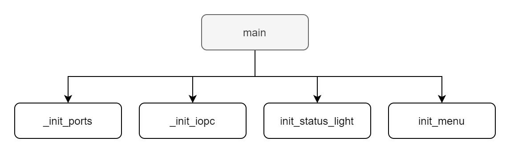
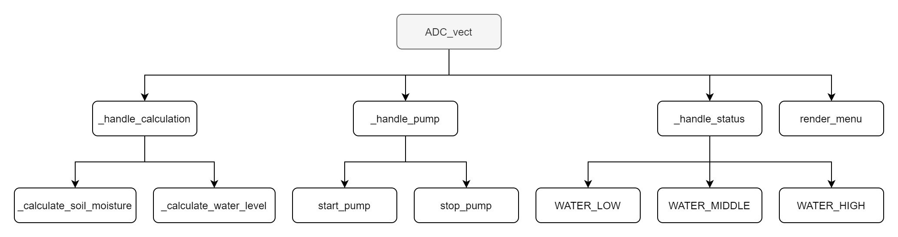

# Plant Watering System
> This is a school project.

## About the project

This approach would be able to service a single plant.

A single SoC should have an LCD that displays metrics about the plant (soil moisture, tank water level). The plant pot should have a soil moisture sensor to help determine when to water the plant. A RGB LED to help show how much water is left in the tank.

### Built with

Works when compiled using [GCC (GNU Compiler Collection)](https://gcc.gnu.org/).

*Components needed for this approach:*
- LCD
- Button
- Soil moisture sensor
- Water level sensor
- Relay (to simulate a water pump)
- RGB LED

## Diagrams

Here are a few diagrams to help better understand the flow of the application.

*The main function*

The main function first initializes the the ports by setting the DDRx (data direction registries). Initializes the interrupt on pin change for the "menu switch button". Initializes the status light. Initializes the menu and finally keeps running in a while loop.

---
 

*The TIMER1_COMPA_vect vector*

The TIMER1_COMPA_vect interrupt is used to change the ports the ADC reads from.

---
 

*The ADC_vect vector*

The ADC_vect interrupt is arguably the most important peice of the puzzle. First it handles calculation and setting of the global variables. Then it decides wether or not the pump should start or stop. Then it determines wether or not it should change the current status of the plant. The status light indicates how much water is left in the tank. It then rerenders the menu on the LCD.

## Dependencies

- main.h
  - avr/io.h
  - avr/interrupt.h
  - util/delay.h
- menu.h
  - menu.h
  - sensors.h
  - status_light.h
  - pump.h
  - lcd.h
- pump.h
  - avr/sfr_defs.h
  - main.h
- sensors.h
  - math.h
  - main.h
  - menu.h
  - pump.h
- status_light.h
  - main.h

## License
Distributed under the MIT License. See `LICENSE` for more information.

## Contact
Sofus Skovgaard - [@sofusskovgaard](https://twitter.com/sofusskovgaard) - [sofus.skovgaard@gmail.com](mailto:sofus.skovgaard@gmail.com)

Project link: [https://github.com/sofusskovgaard/plant-watering-system](https://github.com/sofusskovgaard/plant-watering-system)

## Acknowledgements
- [HD44780 LCD Library](http://www.peterfleury.epizy.com/avr-lcd44780.html) by [Peter Fleury](http://www.peterfleury.epizy.com/)
  - Used to interface with the LCD
- [Atmel Studio 7.0](https://www.microchip.com/mplab/microchip-studio)
  - Used to write/debug project
- [Draw.io](https://draw.io)
  - Used to make the diagrams
